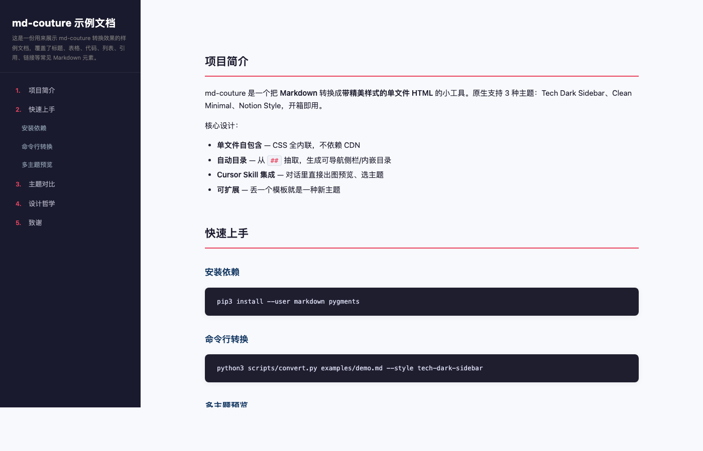
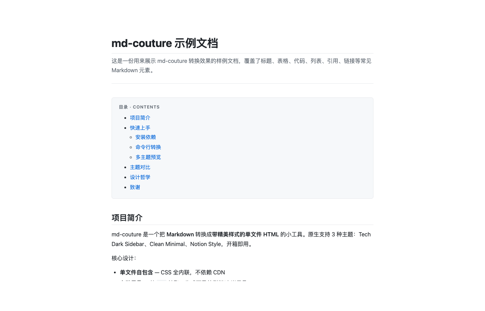
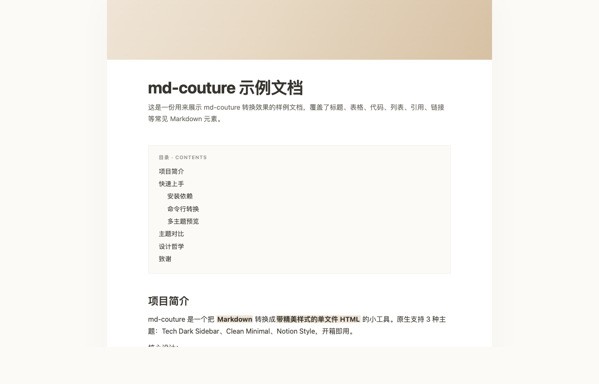

# md-couture

> Stylish Markdown — zero config. 把 Markdown 转成带精美样式的**单文件 HTML**，原生支持 3 种主题，可与 Cursor Skill 对话式预览 / 选主题。

<p align="center">
  
</p>

<p align="center">
  <em>👆 Tech Dark Sidebar 主题 —— 深色导航侧栏 + 红色高亮 + 卡片式内容</em>
</p>

---

## ✨ Features

- 🎨 **3 种内置主题** —— Tech Dark Sidebar / Clean Minimal / Notion Style
- 📦 **单文件自包含** —— CSS 全部内联，不依赖任何 CDN，可直接发送/部署
- 🗂 **自动目录** —— 从 `##` 抽取，生成侧栏/内嵌 TOC，含中文 slug 支持
- 🤖 **Cursor Skill 集成** —— 一句"转 html"，AI 直接在对话里贴图让你选主题
- 🧹 **零工作区污染** —— 中间产物放 skill `.cache/`，7 天自动清理
- 🔌 **可扩展** —— 丢一个 HTML 模板到 `styles/`，自动识别为新主题

---

## 🖼️ 主题预览

### ① `tech-dark-sidebar` —— 默认主题

<p align="center">
  
</p>

适合**技术文档、方法论、长文导读**。深色导航侧栏自动编号，滚动时高亮当前章节。

### ② `clean-minimal`

<p align="center">
  
</p>

GitHub 风，白底窄栏克制。适合 **README、说明文档、博客**。

### ③ `notion`

<p align="center">
  
</p>

暖色封面条 + 柔和排版。适合**笔记、随笔、知识整理**。

---

## 🚀 安装

### 方式一：作为 Cursor Skill（推荐）

```bash
git clone https://github.com/<your-username>/md-couture.git ~/.cursor/skills/md-couture
pip3 install --user markdown pygments
```

装好之后在 Cursor 里说"把 xxx.md 转成 html"或"美化这个文档"，skill 会自动触发。

> Cursor Skill 介绍：<https://docs.cursor.com/agent/skills>

### 方式二：作为独立命令行工具

```bash
git clone https://github.com/<your-username>/md-couture.git
cd md-couture
pip3 install --user markdown pygments
python3 scripts/convert.py examples/demo.md --style tech-dark-sidebar
```

### 可选依赖

- **Chrome / Chromium / Edge**：`preview.py` 会用它生成每种主题的 PNG 缩略图（给 Cursor 对话贴图用）。没装也不影响，只是少了图片预览。

---

## 📖 用法

### 命令行

```bash
# 单主题转换（最常用）
python3 scripts/convert.py <input.md> --style <id>

# 指定输出路径 + 自定义标题
python3 scripts/convert.py input.md -s notion -o out.html --title "我的文档"

# 生成所有主题的预览（多选一）
python3 scripts/preview.py input.md
```

完整参数：

| 参数 | 说明 |
|------|------|
| `--style`, `-s` | 主题 id（默认 `tech-dark-sidebar`） |
| `--output`, `-o` | 输出路径（默认同目录、同名、`.html` 后缀） |
| `--title` | 覆盖标题（默认取 md 里第一个 `# H1`） |

### 在 Cursor 里

直接对 AI 说：

- **"把 xxx.md 转成 html"** → 自动生成 3 主题预览，对话里贴图让你挑
- **"用 notion 风格转这个文档"** → 直接生成
- **"我要之前那个深色风格"** → AI 知道指 `tech-dark-sidebar`

---

## 🎨 自定义主题

想加新主题？在 `styles/` 下放一个 HTML 模板文件，包含以下占位符即可：

| 占位符 | 说明 |
|--------|------|
| `{{TITLE}}` | 文档标题（从第一个 `# H1` 提取） |
| `{{SUBTITLE}}` | 副标题（第一个 H1 之后的引用/斜体段） |
| `{{TOC}}` | 侧栏用目录 HTML（带编号、层级 class） |
| `{{TOC_BLOCK}}` | 内嵌 TOC 卡片 HTML |
| `{{CONTENT}}` | 主体 HTML |

然后在 `scripts/convert.py::STYLE_PRIORITY` 里把新主题 id 加到顺序表中：

```python
STYLE_PRIORITY = ["tech-dark-sidebar", "clean-minimal", "notion", "your-new-theme"]
```

新主题会自动出现在 `preview.py` 的预览网格里，无需改任何代码。

---

## 🗂 项目结构

```
md-couture/
├── SKILL.md                    # Cursor Skill 指令文件
├── README.md                   # 本文档
├── LICENSE
├── scripts/
│   ├── convert.py              # 主转换器
│   └── preview.py              # 多主题预览 + PNG 截图
├── styles/
│   ├── tech-dark-sidebar.html
│   ├── clean-minimal.html
│   └── notion.html
├── examples/
│   └── demo.md                 # 样例 md
└── assets/
    └── screenshots/            # README 用的主题截图
```

---

## 🧩 技术栈

- **Python 3.9+**（只用标准库 + `markdown` + `pygments`）
- **Pure HTML/CSS**（无 JS 框架，单主题仅一小段导航高亮 JS）
- **Headless Chrome**（可选，用于生成 PNG 缩略图）

---

## 📝 License

[MIT](LICENSE) — 自由使用、修改、分发。

---

<p align="center">
  <em>Made with ❤️ for people who write markdown a lot.</em>
</p>
